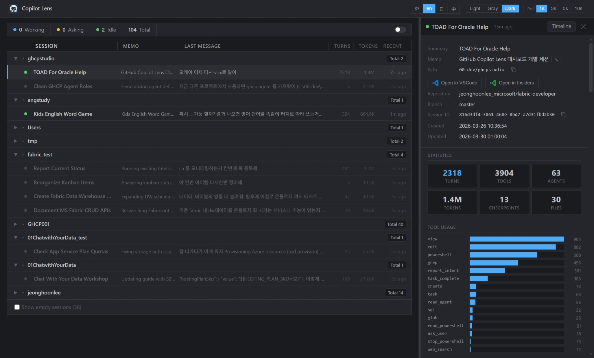
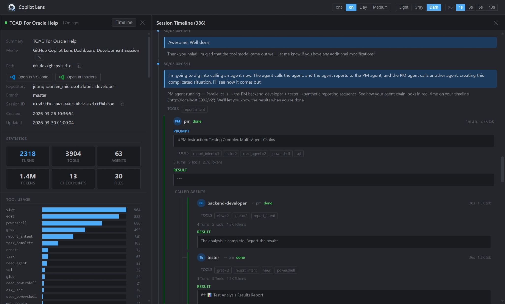
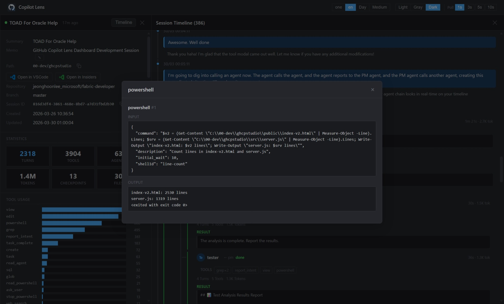
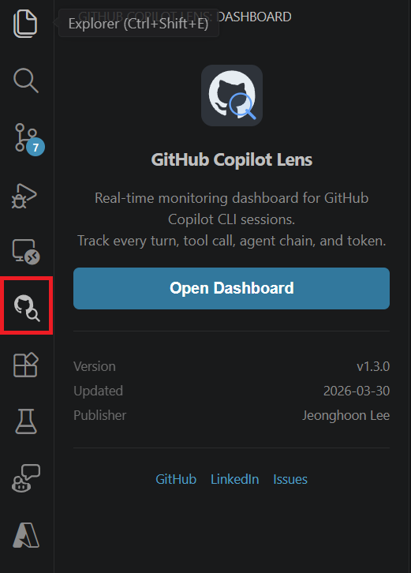

<div align="center">

#  GitHub Copilot Lens

**See everything Copilot does — in real time.**

[](https://marketplace.visualstudio.com/items?itemName=JeonghoonLee.github-copilot-lens)
[](https://opensource.org/licenses/MIT)
[](https://nodejs.org)

A real-time monitoring dashboard for GitHub Copilot CLI sessions.<br>
Watch every turn, tool call, agent chain, and token — live in VS Code or your browser.


</div>

---

## ✨ Why Copilot Lens?

> Ever wonder what Copilot is *actually* doing when it goes quiet for 30 seconds?

| | |
|---|---|
| 🔍 **Full Transparency** | Watch Copilot think, plan, and execute — step by step |
| 🤖 **Multi-Agent Trees** | Visualize nested agent hierarchies unfolding live, up to 6+ levels deep |
| 🛠️ **Tool Inspector** | Click any tool badge to see the exact command, file edit, or API call |
| 📊 **Token Tracking** | Per-turn and per-agent output token counts from the actual LLM API |
| 🎨 **4 Themes · 4 Languages** | Light / Day / Medium / Dark · EN / 한 / 日 / 中 |

---

## 📸 Screenshots

<table>
<tr>
<td width="50%">

**Session Dashboard**


</td>
<td width="50%">

**Agent Hierarchy**


</td>
</tr>
<tr>
<td colspan="2">

**Tool Call Inspector**


</td>
</tr>
</table>

---

## 🚀 Quick Start

### Option 1: VS Code Extension (Recommended)

1. Open **Extensions** panel in VS Code (`Ctrl+Shift+X`)
2. Search **"GitHub Copilot Lens"** and click **Install**
3. Click the **GitHub Copilot Lens** icon in the **left sidebar**
4. Click **Open Dashboard** — that's it!



Or: `Ctrl+Shift+P` → `GitHub Copilot Lens: Open Dashboard`

### Option 2: Standalone (Browser)

```bash
git clone https://github.com/whoniiii/ghcplens.git
cd ghcplens && npm install
node src/server.js
# → http://localhost:3002
```

---

## 🏗️ Features

### 📋 Session Overview
Browse all Copilot CLI sessions grouped by project. See status at a glance — **working**, **asking**, **idle**, or **done** — with turn counts, token usage, and last message preview.

### 🕐 Session Timeline
Drill into any session to see the full conversation: user messages, assistant responses, tool calls, and agent dispatches in chronological order.

### 🌳 Multi-Agent Hierarchy
When Copilot spawns sub-agents, Copilot Lens renders the full **nested call tree** — parent-child relationships, tool badges, model names, token counts, and results — all updating **live** with pulse animations as agents run.

### 🔧 Tool Call Inspector
Click any tool badge to inspect the exact input and output — PowerShell commands, file edits, grep searches, API calls. Nothing is hidden.

### 📊 Statistics
Per-session stats: turns, tools, agents, tokens, checkpoints, and modified files — with horizontal bar charts for tool usage distribution.

### ⚙️ And More...
- **Configurable Polling** — 1s, 3s, 5s, 10s auto-refresh
- **VS Code Integration** — Open project in VS Code / Insiders with one click
- **Editable Memo** — Tag sessions with custom notes
- **Copy** — Session ID and path to clipboard
- **Auto-connect** — Dashboard loads automatically, no setup required

---

## 🔒 Privacy

Copilot Lens reads from `~/.copilot/session-state/` on your local machine.

**No data is sent anywhere. No telemetry. No network calls. Everything stays on your computer.**

---

## 🧱 Tech Stack

```
Server    → Node.js (pure http module — zero dependencies, no Express)
Frontend  → Single HTML file, vanilla JavaScript, inline CSS
Tests     → Vitest (92 tests)
Port      → 3002 (default)
```

---

## 🧪 Testing

```bash
npm test           # Run all 92 tests
npm run dev        # Start dev server with auto-reload
```

---

## 📄 License

[MIT](LICENSE) — free and open source.

---

<div align="center">

**Built for the GitHub Copilot community** 🚀

[Marketplace](https://marketplace.visualstudio.com/items?itemName=JeonghoonLee.github-copilot-lens) · [GitHub](https://github.com/whoniiii/ghcplens) · [Issues](https://github.com/whoniiii/ghcplens/issues) · [Author](https://www.linkedin.com/in/jeonghlee8024)

</div>
